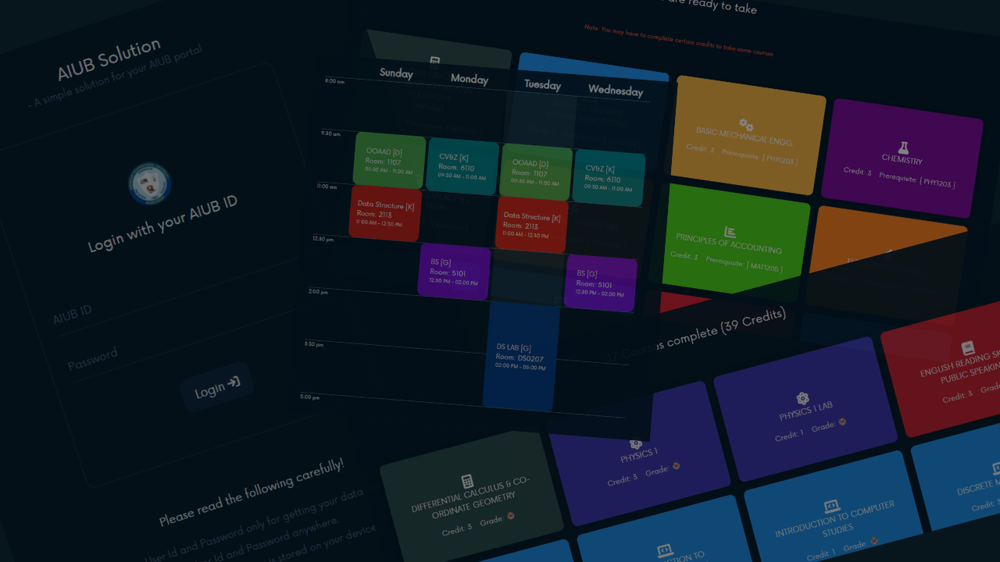

# AIUB Solution

This app allows users to easily keep track of their class schedule, courses they complete and unlocked courses they can takte next semester. Simply login with the AIUB id and password and the app will gather all data to generate all UI. You only need to login once just to fetch data. We do not store any of your information

## Note
- Data is stored only on the device, ensuring privacy

## Instructions for Use:
1. Open the app
2. Login with your portal username and password

No internet connection is required to use this app after you've loaded data once.

Give it a try today!

Proxy server: https://github.com/BrainbirdLab/AIUB_Course_Info_API
